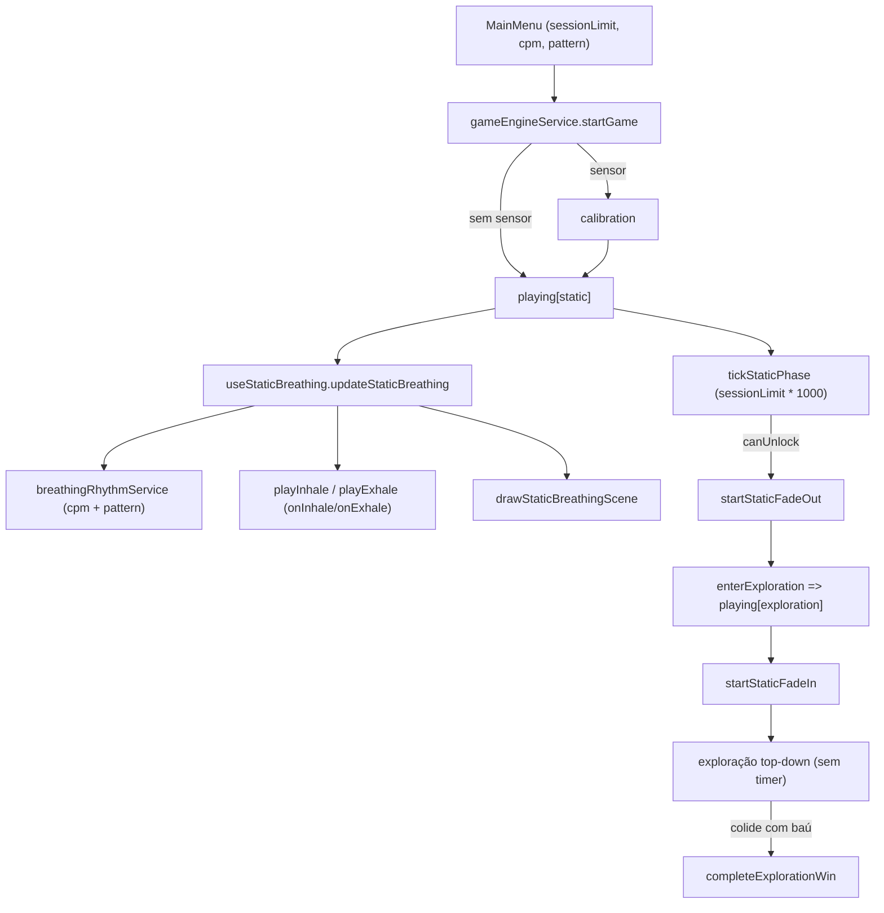
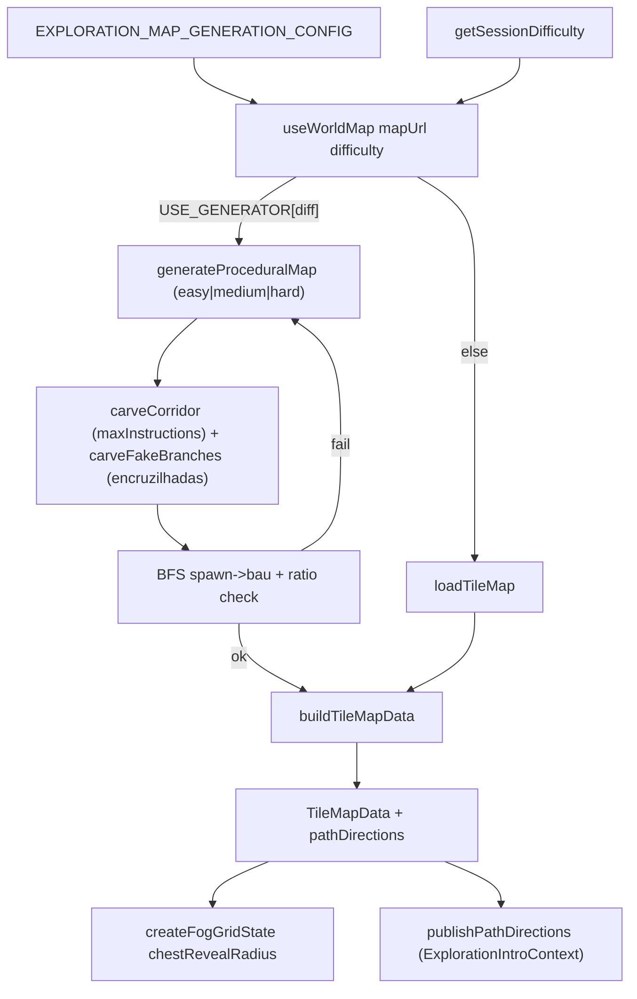

# Mapa de Arquitetura — Trilha do Tesouro

**Onde fica cada coisa.** Guia para localizar funcionalidades, arquivos e fluxos. Use **Ctrl+F** para buscar palavras-chave.

---

## Índice alfabético (palavras-chave)

| Palavra-chave                     | Onde está                                                                                                                          | Seção                                         |
| --------------------------------- | ---------------------------------------------------------------------------------------------------------------------------------- | --------------------------------------------- |
| **RMSSD tier**                    | `VFCService.ts` (`computeRmssdTier`), `useVFC`, `useCompanions`                                                                    | [RMSSD tier](#rmssd-tier)                     |
| **Background / Parallax**         | `useBackgroundLayers`, `BACKGROUND_LAYERS`                                                                                         | [Background](#background)                     |
| **Baseline / Calibração**         | `VFCService`, `CalibrationScreen`                                                                                                  | [Baseline](#baseline)                         |
| **Bluetooth / BLE**               | `BLEService`, `useBluetooth`                                                                                                       | [Bluetooth](#bluetooth)                       |
| **Companheiros / Amigos**         | `useCompanions`, `gameCanvas`                                                                                                      | [Companheiros](#companheiros)                 |
| **Dificuldade (menu / companheiros)** | `constants.ts` (`MenuDifficultyId`, `MENU_DIFFICULTY_*`, `SESSION_DIFFICULTY_API_VALUE`), `companionDifficultyService`, `VFCService.markCalibrationComplete`, `gameEngineService`, `MainMenu`, `gameCanvas` | [Dificuldade](#dificuldade-menu--companheiros) |
| **Calibração (tela)**             | `CalibrationScreen`                                                                                                                | [Calibração](#calibração)                     |
| **Canvas / Game Loop**            | `gameCanvas`, `gameLoopService`                                                                                                    | [Canvas](#canvas)                             |
| **Respiração estática (pré-exploração)** | `STATIC_BREATHING_CONFIG`, `staticBreathingService`, `useStaticBreathing`, `breathingRhythmService`                          | [Respiração estática](#respiração-estática-pré-exploração) |
| **Tilemap / Exploração top-down** | `public/data/maps/`, `tileMapService`, `useWorldMap`, `useExplorationPlayer`                                                       | [Tilemap](#tilemap-exploração-top-down)       |
| **Geração procedural (por dificuldade)** | `mapGeneratorService`, `EXPLORATION_MAP_GENERATION_CONFIG`, `useWorldMap`                                                          | [Geração procedural](#geração-procedural-de-mapa-opcional) |
| **Neblina (opcional)**            | `farm_playtest_fog.json`, `fogLayerService`, `useFogLayer`, `EXPLORATION_FOG_ENABLED`                                              | [Neblina](#neblina-opcional)                  |
| **Baú / vitória exploração**      | `chest_position` no JSON, `chestService`, `useExplorationChest`, `ExplorationWinOverlay`                                             | [Baú e vitória](#baú-e-vitória-exploração)    |
| **Indicador HUD (ícone on/off)**  | `INDICATOR_CONFIG`, `StatusBar`, `useIndicator`                                                                                    | [Indicador](#indicador)                       |
| **Acessibilidade (brilho)**       | `AccessibilityProvider`, `global.tsx`                                                                                              | [Acessibilidade](#acessibilidade)             |
| **Partículas**                    | `useParticles`, `PARTICLES_CONFIG`                                                                                                 | [Partículas](#partículas)                     |
| **Personagem principal**          | `usePlayer`, `PLAYER_CONFIG`                                                                                                       | [Personagem](#personagem)                     |
| **RMSSD**                         | `VFCService`, `useVFC`                                                                                                             | [RMSSD](#rmssd)                               |
| **Parâmetros VFC**                | `constants.ts` — `VFC_CONFIG`                                                                                                      | [Parâmetros VFC](#parâmetros-vfc-constantsts) |
| **Score / Pontuação**             | `gameEngineService`, `updateScore`                                                                                                 | [Score](#score)                               |
| **Sessão / Formatação / Envio**   | `formatSessionDataService`, `postSessionDataService`, `sessionTokenInitService`, `VFCService` (marcadores de janela), `gameCanvas` | [Sessão](#sessão)                             |
| **Áudio / Música**                | `audioService`, `useAudio`                                                                                                         | [Áudio](#áudio)                               |
| **Tema dos menus**                | `MenuThemeProvider`, `themeGame`, `themeLight`                                                                                     | [Tema](#tema)                                 |
| **GameOver**                      | `Game/GameOver.tsx`                                                                                                                | [GameOver](#gameover)                         |
| **MainMenu**                      | `MainMenu/`                                                                                                                        | [MainMenu](#mainmenu)                         |
| **Welcome**                       | `WelcomeScreen/`                                                                                                                   | [Welcome](#welcome)                           |
| **Pause**                         | `PauseMenu/`                                                                                                                       | [Pause](#pause)                               |
| **StatusBar**                     | `StatusBar/`                                                                                                                       | [StatusBar](#statusbar)                       |
| **TopBar**                        | `TopBar/`                                                                                                                          | [TopBar](#topbar)                             |
| **SensorInfo**                    | `SensorInfoMenu/`                                                                                                                  | [SensorInfo](#sensorinfo)                     |
| **Orientação**                    | `OrientationWarning`, `useOrientation`                                                                                             | [Orientação](#orientação)                     |
| **Fase respiração**               | `BreathingPhaseProvider`, `breathingRhythmService`                                                                                 | [Fase respiração](#fase-respiração)           |
| **Portal / iframe pai**           | `portalBridge/` (`notifyGameOver`, `notifyBackToPortal`)                                                                           | [Portal](#portal)                             |
| **Biofeedback / Lógica vs React** | Princípio crítico                                                                                                                  | [Biofeedback](#princípio-crítico-biofeedback) |

---

## Princípio crítico: Biofeedback

⚠️ **Não misture lógica de biofeedback com React.**

O jogo depende de dados fisiológicos em tempo real (frequência cardíaca, RR intervals, RMSSD). O ciclo de renderização do React pode introduzir atrasos, re-renders desnecessários e interferir na precisão do feedback visual e sonoro.

**Regras:**

| Onde                  | O que colocar                                                                             |
| --------------------- | ----------------------------------------------------------------------------------------- |
| **`src/services/`**   | Toda a lógica de BLE, VFC, game loop, áudio. **Sem** `import` de React.                   |
| **`src/hooks/`**      | Apenas a ponte entre serviços e componentes — subscribe/state, sem cálculos pesados.      |
| **`src/components/`** | Apenas apresentação e eventos do usuário. **Nenhum** cálculo de RMSSD, baseline ou score. |

**Por quê:** Cálculos no ciclo React (ex.: dentro de `useEffect` ou durante render) podem atrasar o processamento de RR intervals, dessincronizar respiração/aura e prejudicar a proposta terapêutica.

**Resumo:** Lógica de biofeedback → **services**. React → **exibir** e **disparar ações**.

---

## Índice por localização

### Pastas

| Caminho           | Conteúdo                                                                                        |
| ----------------- | ----------------------------------------------------------------------------------------------- |
| `src/components/` | Componentes React de UI. Cada subpasta: `index.tsx` (lógica) + `styles.tsx` (styled-components) |
| `src/contexts/`   | Providers React para estado global                                                              |
| `src/hooks/`      | Custom hooks que conectam componentes aos serviços                                              |
| `src/services/`   | Lógica pura (sem React): BLE, VFC, Game, Áudio, API                                             |
| `src/types/`      | Tipagens TypeScript                                                                             |
| `src/utils/`      | Constantes e funções auxiliares                                                                 |
| `src/styles/`     | Estilos globais e temas                                                                         |
| `public/assets/`  | Imagens e sons                                                                                  |

### Componentes (acesso: `src/components/<Nome>/`)

| Componente             | Caminho                              | Quando aparece                    |
| ---------------------- | ------------------------------------ | --------------------------------- |
| **CalibrationScreen**  | `src/components/CalibrationScreen/`  | Estado `calibration`              |
| **Game**               | `src/components/Game/`               | Sempre (container raiz)           |
| **GameOver**           | `src/components/Game/GameOver.tsx`   | Estado `gameOver`                 |
| **MainMenu**           | `src/components/MainMenu/`           | Estado `mainMenu`                 |
| **OrientationWarning** | `src/components/OrientationWarning/` | Quando tela em retrato            |
| **PauseMenu**          | `src/components/PauseMenu/`          | Estado `paused`                   |
| **SensorInfoMenu**     | `src/components/SensorInfoMenu/`     | Modal (clique no ícone do sensor) |
| **StatusBar**          | `src/components/StatusBar/`          | Durante `playing` ou `restarting` |
| **TopBar**             | `src/components/TopBar/`             | Durante `playing` ou `restarting` |
| **WelcomeScreen**      | `src/components/WelcomeScreen/`      | Estado `welcome`                  |

---

# Seções detalhadas (por palavra-chave)

---

## RMSSD tier

**O que é:** Um **nível** que classifica o RMSSD atual em relação à **referência de jogo** (segundo argumento de `computeRmssdTier`). O serviço chama `computeRmssdTier(rmssd, baseline)` e o resultado é um inteiro **`RmssdTier`** (sempre **0**, **1**, **2**… — não é um valor “liso” contínuo). Cada número representa uma **faixa de intensidade**: o quanto o RMSSD está acima dessa referência. Os **saltos** entre um nível e o seguinte vêm dos multiplicadores em `VFC_CONFIG.RMSSD_TIER_ABOVE_BASELINE_MULTIPLIERS` (ex.: só passa para o próximo nível quando o RMSSD atinge `referência × 1,2`, etc.).

**Referência em Fácil/Médio vs Difícil:** em **Fácil** e **Médio**, após `markCalibrationComplete(difficulty)`, o `VFCService` mantém o RMSSD de **calibração** como `vfcState.baseline` para o tier durante a partida. Em **Difícil**, a referência é a **mediana deslizante** habitual. Ver [Dificuldade](#dificuldade-menu--companheiros).

**Leitura orientativa** (exemplo com a configuração típica do template — **quatro** faixas acima da baseline, tiers **1** a **4**):

| Tier  | Intensidade (leitura informal)     |
| ----- | ---------------------------------- |
| **0** | Muito baixo: na baseline ou abaixo |
| **1** | Levemente acima da baseline        |
| **2** | Moderado                           |
| **3** | Alto                               |
| **4** | Muito alto                         |

O tier máximo possível é **`getMaxRmssdTier()`** (= 1 + número de multiplicadores no array); ao acrescentar multiplicadores, aparecem níveis **5**, **6**, etc., com a mesma lógica de limiares.

**Para que serve:** Resume a **intensidade** do estado fisiológico inferido pelo RMSSD vs baseline e pode ser usado para dirigir comportamentos no jogo, por exemplo:

- reação dos companheiros com sensor;
- efeitos visuais ou feedback;
- outras mecânicas de gameplay.

**O que NÃO é:** **Não** é o RMSSD tier. O valor **`activeCompanionHudCount`** reflete **quantos companheiros estão ativos** na cena (até o teto de slots do HUD).

**Onde é calculado:**

- `src/services/vfc/computeRmssdTier.ts` — função pura; importada por `VFCService.ts`.
- `src/services/vfc/VFCService.ts` — em `runMetricsUpdate`, após baseline pronta, `vfcState.rmssdTier = computeRmssdTier(rmssd, baselineValue)` onde `baselineValue` é snapshot de calibração (Fácil/Médio) ou mediana deslizante (Difícil); tier máximo = `getMaxRmssdTier()`.

**Onde é consumido:**

- `src/components/Game/gameCanvas.tsx` — `rmssdTier` / `effectiveRmssdTier` → `updateCompanions()` e `updateScore()`
- `src/hooks/useCompanions.ts` — `updateCompanions(..., rmssdTier, ...)` (entrada/saída com sensor)
- `src/hooks/useVFC.ts` — expõe `rmssdTier` para UI que precise do valor

**Fluxo:** `runMetricsUpdate` (intervalo `VFC_CONFIG.METRICS_INTERVAL_MS`) → `vfcState.rmssdTier` → `getVFCState()` → `useVFC()` / canvas

---

## Background

**O que é:** Camadas de cenário com parallax (velocidades diferentes de scroll).

**Onde está configurado:**

- `src/utils/constants.ts` — `BACKGROUND_LAYERS`, `BACKGROUND_IMAGE_WIDTH`
- Exemplo: `{ id: 'sky', src: '/assets/images/background/ceu.png', speed: 0.3 }`

Se o GDD pedir movimento ou profundidade, cada plano deve virar uma camada separada em `BACKGROUND_LAYERS` e um asset próprio em `public/assets/images/background/`.

**Onde é usado:**

- `src/hooks/useBackgroundLayers.ts` — carrega imagens, `updateBackground()`, `drawBackground()`, `resizeBackground()`
- `src/components/Game/gameCanvas.tsx` — chama no game loop: `updateBackground()` e `drawBackground()`

**Convenção:** `speed: 0` = estático; `speed: 1` = velocidade base; `speed > 1` = mais rápido (frente).

---

## Baseline

**O que é:** Limiar RMSSD usado como referência. Começa como mediana dos **N** primeiros RMSSD válidos (N = `VFC_CONFIG.BASELINE_SAMPLES`, **omissão 20** no template), após descartar os primeiros **`BASELINE_IGNORE_SAMPLES`** RMSSD para estabilização (**omissão 5**). Durante o jogo, o limiar é atualizado com **janela deslizante** das últimas **N** amostras de RMSSD.

**Onde é calculado:**

- `src/services/vfc/VFCService.ts` — `getMedian()`, `runMetricsUpdate()`
- Parâmetros em `src/utils/constants.ts` — `VFC_CONFIG.BASELINE_SAMPLES`, `BASELINE_IGNORE_SAMPLES`

**Onde mudar N (pré-jogo e durante a partida):**

- Alterar `VFC_CONFIG.BASELINE_SAMPLES` em `src/utils/constants.ts`.
- Esse mesmo valor controla:
  - a calibração inicial (quantidade de amostras para liberar o jogo);
  - a janela deslizante dinâmica durante a partida (tamanho da janela do limiar).
- O progresso `X/N` na CalibrationScreen e no menu de sensor acompanha `VFC_CONFIG.BASELINE_SAMPLES`.

**Diferença entre baseline e calibration_samples (envio ao backend):**

- **Baseline (N amostras de RMSSD):** Usado apenas para o cálculo do limiar em tempo real (RMSSD tier, score). Não confundir com o envio de RR: a janela de **N** valores serve só para a **mediana** do limiar.
- **calibration_samples (ao backend):** Intervalos RR brutos da fase de calibração apenas — do início da calibração até `markCalibrationComplete()` (ao sair da tela de calibração). O trecho entre o fim da calibração e o jogador “chegar” não entra nem em `calibration_samples` nem em `samples` (ver [Sessão](#sessão)).

**Onde é exibido:**

- `src/components/CalibrationScreen/index.tsx` — texto "MEDIANA" e progresso (`X/VFC_CONFIG.BASELINE_SAMPLES`)
- `src/components/StatusBar/index.tsx` — `baselineStatus` ("LIMIAR: X" quando pronto; vazio até lá)
- `src/components/SensorInfoMenu/index.tsx` — "Limiar VFC" em ms

**Fluxo:** RR intervals → `processVFCData` → `beats` → (a cada `VFC_CONFIG.METRICS_INTERVAL_MS`, **omissão 1 s**) `runMetricsUpdate` → `getValidRRs` → `calculateRMSSD` → `baselineSamples` → `getMedian` → `vfcState.baseline`

---

## Bluetooth

**O que é:** Conexão Web Bluetooth com sensor de frequência cardíaca. Lê BPM, RR intervals e bateria.

**Onde está a lógica:**

- `src/services/bluetooth/BLEService.ts` — `createBLEService()`, `connect()`, `disconnect()`, `handleHeartRateMeasurement()`
- Ao receber RR: faz sanidade (260–2000 ms), **gap detection** (insere batimentos sintéticos `deviceFiltered` quando o dispositivo suprime batimentos), chama `processVFCData()` de `../vfc`. Batidas sintéticas (`deviceFiltered: true`) **não** entram em `sessionSamples` (export); só alimentam a janela interna de VFC.

**Hook:**

- `src/hooks/useBluetooth.ts` — expõe `isConnected`, `deviceName`, `batteryLevel`, `heartRate`, `lastDataReceivedAt`, `lastRRReceivedAt`, `sensorContactStatus`, `connect()`, `disconnect()`, `isLoading`, `error`

**Onde é usado:**

- `src/components/MainMenu/index.tsx` — botão Conectar/Desconectar (aba Conexão)
- `src/components/CalibrationScreen/index.tsx` — status do sensor
- `src/components/Game/index.tsx` — estado do ícone do sensor usa conexão + RR recente + contato
- `src/components/SensorInfoMenu/index.tsx` — status amigável usa RR recente e contato com pele
- `src/components/Game/gameCanvas.tsx` — `isConnected` para lógica de score e companheiros

**Configuração:** `src/utils/constants.ts` — `BLE_CONFIG.DEVICE_NAME_PREFIX`, `BATTERY_UPDATE_INTERVAL`

**Regra operacional de sinal:** conexão BLE **não** garante biofeedback válido. O app considera sinal fisiológico “vivo” com RR recente (`lastRRReceivedAt`) e sem indicação de perda de contato (`sensorContactStatus !== 'not-detected'`).

---

## Calibração

**O que é:** Tela que coleta **`VFC_CONFIG.BASELINE_SAMPLES`** amostras RMSSD para calcular o baseline antes do jogo (quando o sensor está conectado).

**Como acessar:** `src/components/CalibrationScreen/`

- `index.tsx` — lógica e UI
- `styles.tsx` — styled-components

**Responsabilidades:**

- Mostrar status do sensor (conectado/desconectado, FC)
- Gráfico SVG com `baselineSamplesSnapshot` e mediana
- Barra de progresso (`X / BASELINE_SAMPLES` amostras)
- Aviso quando o sensor está conectado mas **não** há RR “recente” conforme `BLE_CONFIG.RR_SIGNAL_STALE_MS` (**omissão 3 s**)
- Botão Voltar (`goToMainMenu`)
- Chamar `completeCalibration()` quando baseline pronto e mínimo 800ms na tela

**Dependências:** `useGameEngine`, `useBluetooth`, `useVFC`, `VFC_CONFIG`

**Quando aparece:** `state.currentState === 'calibration'` (após "Iniciar" no MainMenu com sensor conectado)

---

## Canvas

**O que é:** Área de desenho do jogo e loop de animação.

**Como acessar:** `src/components/Game/gameCanvas.tsx`

**Responsabilidades:**

- Montar e iniciar o game loop (`createGameLoop()`)
- A cada frame: limpar, desenhar background, personagem, companheiros, partículas
- Atualizar score (a cada 1s), player, companions, particles
- Exportar sessão e tocar som ao game over
- Usar `BreathingPhaseContext` para fase da respiração

**Hooks usados:** `useCanvas`, `useAudio`, `useBluetooth`, `useBackgroundLayers`, `usePlayer`, `useCompanions`, `useParticles`, `useGameEngine`

**Serviços chamados:** `getVFCState()`, `formatSessionData()`, `postSessionData()`

**Loop:** `src/services/game/gameLoopService.ts` — `createGameLoop()`, `onUpdate()`, `start()`, `stop()`, `pause()`, `resume()`

**Modo exploração (top-down):** `useWorldMap`, `useExplorationPlayer`, `useInput` — ver [Tilemap](#tilemap-exploração-top-down).

---

## Respiração estática (pré-exploração)

**O que é:** Cena de respiração guiada que **antecede** a fase top-down. O fazendeiro aparece centralizado e o canvas desenha **frame a frame** o spritesheet vertical `farmerfull_breathing.png` (com `STATIC_BREATHING_CONFIG.BREATHING_FRAMES` quadros empilhados), varrendo `0..N-1` ao longo de **um ciclo respiratório completo** (inspira + expira) e reiniciando no próximo ciclo — mesmo padrão dos spritesheets de walk do top-down. O ritmo é cravado no `cyclesPerMinute` + `BreathingPatternId` escolhidos no menu. O PNG `farmerfull_idle.png` é mantido como **pose neutra estática** (1 frame) e desenhado por `drawStaticBreathingIdle` em estados sem sessão ativa (pause / welcome). Quando o tempo escolhido termina, o motor faz um **fade preto curto** e entra automaticamente em exploração.

**Quando dispara:** `gameplayMode === 'static'` + `currentState === 'playing'` + `sessionStarted === true` + `FEATURE_FLAGS.TOPDOWN_PLAYTEST_ENABLED`. Para jogos do template sem fase estática, basta desligar `TOPDOWN_PLAYTEST_ENABLED` (ou nunca entrar em `gameplayMode === 'static'`).

**Onde está:**

- **Constantes** ([src/utils/constants.ts](src/utils/constants.ts)):
  - `STATIC_BREATHING_CONFIG` — sprites (`IMAGES.IDLE`, `IMAGES.BREATHING_SHEET`, `IMAGES.BACKGROUND`), `BREATHING_FRAMES`, `BACKGROUND_FIT` (`fill` | `cover`), `BACKGROUND_DIM_OPACITY` / `BACKGROUND_DIM_COLOR` (overlay escuro sobre o JPEG), `BACKGROUND_COLOR` (fallback), `SCREEN_HEIGHT_FRACTION`, `PLAY_SFX`.
  - `STATIC_BREATHING_TRANSITION_CONFIG` — `FADE_OUT_MS`, `FADE_IN_MS`, `FADE_COLOR`. `FADE_OUT_MS: 0` desliga o fade.
  - `GAMEPLAY_TRANSITION_CONFIG.STATIC_FALLBACK_MIN_MS` — usado se `sessionLimit` vier inválido.
- **Serviços** ([src/services/staticBreathing/](src/services/staticBreathing/)):
  - `staticBreathingService.ts` — `createStaticBreathingImageRegistry`, `preloadStaticBreathingImages`, `computeStaticBreathingFrame`, `drawStaticBreathingScene` (recorta o frame `[0, sy → sy + frameH]` do sheet a partir de `frameIndex` e desenha centralizado), `drawStaticBreathingIdle` (desenha o PNG estático `IDLE` para estados sem sessão — pause/welcome).
  - `transitionService.ts` — `createTransitionState`, `beginFadeOut/In`, `advanceTransition`, `getTransitionAlpha`, `drawTransitionOverlay`.
- **Hook** ([src/hooks/useStaticBreathing.ts](src/hooks/useStaticBreathing.ts)) — pré-carrega imagens, expõe `updateStaticBreathing`, `drawStaticBreathing`, `resetStaticBreathing` e as APIs da transição. Callbacks opcionais `onInhale`/`onExhale` para plugar áudio sem o hook conhecer o `useAudio`.
- **Engine** ([src/services/game/gameEngineService.ts](src/services/game/gameEngineService.ts)) — `tickStaticPhase` agora devolve `boolean` (`canUnlock`) em vez de chamar `enterExploration` direto. O caller (gameCanvas) controla o fade entre fases. Durante `gameplayMode === 'exploration'` o timer é **congelado** (`updateTimer` retorna cedo) — a partida termina quando o jogador toca o baú, não por tempo.
- **Ritmo** ([src/services/game/breathingRhythmService.ts](src/services/game/breathingRhythmService.ts)) — `getIntervalBreathingState` (4 fases) e o novo `getContinuousBreathingState` (2 fases). O serviço da respiração estática só consome essas funções, sem duplicar matemática.

**Duração:** vem do slider **"Tempo de respiração"** do menu (`getSessionLimit()` em segundos). Sem mudar nada de código, o usuário pode respirar entre 60s e 600s. Em sessões com sensor BLE, a fase também espera o "tier sustentado por `TIER_HOLD_MS`" antes de liberar.

**Animação (spritesheet vertical):** `computeStaticBreathingFrame` calcula `cycleProgress01 ∈ [0, 1]` e mapeia para `frameIndex = floor(cycleProgress01 * BREATHING_FRAMES)`. O sheet faz **loop perfeito**: frame `0` ≈ frame `N-1` = peito vazio, e ~frame `N/2` = peito cheio. A forma do movimento (subida do peito, descida) já está embutida na arte; o código só decide com que velocidade varrer a sequência e onde "segurar".

**`BreathingPatternId` → curva visual + fase de áudio:**

| Pattern        | Curva visual (`cycleProgress01`)                                                                                                      | Fase `inhaling` (`onInhale`)             | Fase `exhaling` (`onExhale`)              |
| -------------- | -------------------------------------------------------------------------------------------------------------------------------------- | ---------------------------------------- | ----------------------------------------- |
| `continuous`   | Linear `0 → 1` no ciclo (varre o sheet inteiro uniformemente).                                                                          | 1ª metade do ciclo                       | 2ª metade do ciclo                        |
| `intervals`    | Ordem cronológica `up → top → down → bottom`. Em t=0 começa em `up` (`0 → 0.5`, varre vazio → cheio). Depois segura em `0.5` durante `top` (frame N/2 = cheio), varre `0.5 → 1` em `down` (cheio → vazio) e segura em `0` durante `bottom` (frame 0 = vazio). Os ratios `BREATHING_INTERVAL_PHASE_RATIOS` definem quanto tempo cada fase ocupa. | fases `up` + `top` (sobe + segura cheio) | fases `down` + `bottom` (desce + segura vazio) |

> **Dependência da arte:** o hold "peito vazio" em `intervals` reusa o frame `0` no fim do `down` (`cycleProgress01: 1 → 0`). Isso só é invisível porque o sheet tem **loop perfeito**. Ao trocar o PNG, garantir que o último frame combine visualmente com o primeiro (ou ajustar o hold para `1` em `breathingRhythmService.ts`).

**Áudio (`PLAY_SFX: true`):** o hook dispara `onInhale(durationSeconds)` ao **entrar** em `inhaling` e `onExhale(durationSeconds)` ao entrar em `exhaling`. No `gameCanvas`, estes callbacks chamam `playInhale`/`playExhale` do `useAudio` — exatamente os mesmos SFX usados pelo legacy ocean.

**Transição leve para a exploração:** controlada no canvas, em 3 frames lógicos:

1. `tickStaticPhase` devolve `canUnlock === true` (tempo + tier OK).
2. Canvas chama `startStaticFadeOut()` — overlay preto interpola `alpha: 0 → 1` em `FADE_OUT_MS`.
3. No fim do fade-out: `enterExploration()` (swap de `gameplayMode`) + `startStaticFadeIn()` — overlay vai `1 → 0` em `FADE_IN_MS`. Aí `finishTransition()` deixa o estado limpo.

**Ordem de desenho dentro do loop:**



**Reset:** `resetStaticBreathing` é chamado no efeito `isStartingNewGame` no `gameCanvas` (mesmo lugar dos outros resets: player, fog, chest). Limpa a fase atual e zera qualquer transição em andamento.

### Barra Guia de Respiração (estática + exploração)

**O que é:** barra vertical em **DOM** (não no canvas) na fase estática e na exploração top-down. Acompanha o ritmo da sessão via `computeStaticBreathingFrame` (mesmo CPM/padrão do menu). Na estática, sincroniza com a animação do fazendeiro; na exploração, continua o mesmo relógio de sessão com tamanho menor (`EXPLORATION_SIZE`).

**Onde está:**

- **Constantes** ([src/utils/constants.ts](src/utils/constants.ts)): `BREATHING_GUIDE_BAR_CONFIG` — `ENABLED`, `POSITION`, `MARGIN_PX`, `BREATHING_SIZE` (`WIDTH_PX`, `HEIGHT_FRACTION`), `EXPLORATION_SIZE`, `FILL_COLOR`, `FILL_AREA`, `IMAGES.TRACK`/`INDICATOR`.
- **Componente** ([src/components/Game/BreathingGuideBar/index.tsx](src/components/Game/BreathingGuideBar/index.tsx)): frame (`FrameGuiaDeRespiracao.png`) + preenchimento interno; bolinha só como fallback.

**Mapeamento `cycleProgress01` → indicador:** `progressFromTop01 = 1 - 2 * min(cp, 1 - cp)` (CP=0 ou 1 → fundo, CP=0.5 → topo).

**Quando aparece:** `ENABLED` + `sessionStarted` + (`gameplayMode === 'static'` ou `'exploration'`). Oculta durante a intro da abelha (`isIntroActive`). Tamanho: `BREATHING_SIZE` na estática, `EXPLORATION_SIZE` na exploração.

**Ritmo na exploração:** `gameEngineService.updateTimer` continua a somar `internalElapsedTime` em exploração (para a barra e outros consumidores de `getSessionPlayElapsedMs`), mas **não** atualiza `timeRemaining` nem dispara fim de partida por tempo — a vitória é no baú.

**Trocar por arte:** `IMAGES.TRACK` / `IMAGES.INDICATOR` em constants — sem mudar código.

---

### Intro do tutorial (abelha + balão de fala)

**O que é:** sequência narrativa que abre **toda partida** de exploração: backdrop escurecido + abelha entrando voando pela direita → balão de fala no centro → abelha saindo pelo canto superior esquerdo após o jogador clicar "Continuar". Durante toda a intro, o input do jogador fica **bloqueado**.

**Onde está:**

- **Constantes** ([src/utils/constants.ts](src/utils/constants.ts)): `EXPLORATION_INTRO_CONFIG` — `ENABLED`, `BACKDROP_OPACITY`, `BEE` (`IMAGE`, `FRAMES`, `WING_FPS`, `SCREEN_HEIGHT_FRACTION`, `ENTRY_FROM`/`IDLE_AT`/`EXIT_TO` em fração de viewport, durações, `EASING`), `SPEECH_BUBBLE` (`OFFSET`, `PLACEMENT`, `TEXT_COLOR`, `MIN_WIDTH_PX`/`MAX_WIDTH_PX`, `MAX_HEIGHT_PX`, `CONTINUE_LABEL`), `MESSAGE_TEMPLATE`, `FALLBACK_MESSAGE`.
- **Tipos** ([src/types/tutorial.ts](src/types/tutorial.ts)): `TutorialMessage`, `TutorialSequence`, `ExplorationIntroPhase` (`'idle'|'entering'|'speaking'|'exiting'|'done'`).
- **Context** ([src/contexts/explorationIntroContext.ts](src/contexts/explorationIntroContext.ts) + [ExplorationIntroProvider.tsx](src/contexts/ExplorationIntroProvider.tsx)): `{ isIntroActive, setIntroActive, pathDirections, setPathDirections }`. Mantido leve — apenas para o `gameCanvas` saber quando travar input e para propagar `pathDirections` do `useWorldMap` (gameCanvas) até o overlay (Game/index.tsx).
- **Hook** ([src/hooks/useExplorationIntro.ts](src/hooks/useExplorationIntro.ts)): máquina de estados + interpolação de posição (`easeInOutQuad`). Recebe `trigger`, `pathDirections`, `viewport` e expõe `phase`, `text`, `beePosition`, `beeFacingRight`, `advance`.
- **Componentes**:
  - [src/components/Game/SpeechBubble/index.tsx](src/components/Game/SpeechBubble/index.tsx) — balão reutilizável; arte em `EXPLORATION_INTRO_CONFIG.SPEECH_BUBBLE.IMAGE` + `PADDING` para texto/botão.
  - [src/components/Game/TutorialBee/index.tsx](src/components/Game/TutorialBee/index.tsx) — `<canvas>` DOM separado, RAF interno só para animar as asas; posição vem via props; flip via `transform: scaleX(-1)`.
  - [src/components/Game/ExplorationIntro/index.tsx](src/components/Game/ExplorationIntro/index.tsx) — orquestrador (backdrop + TutorialBee + SpeechBubble) + reflexão no context.
  - [src/components/Game/index.tsx](src/components/Game/index.tsx) → `ExplorationIntroOrchestrator` (interno) — detecta o edge `static → exploration` e dispara o overlay (resetando ao final). O `Game` exportado wrappa tudo em `<ExplorationIntroProvider>`.

**Texto da mensagem:** `MESSAGE_TEMPLATE.replace('{directions}', formatPathDirections(pathDirections))`. Para `pathDirections = ['up','up','up','left','left','up']` o resultado é `"Olá! Vá para cima, depois para a esquerda, depois para cima para encontrar o baú!"` — formato narrativo, sem contagem ("3x cima" vira só "cima"). O número de instruções é controlado por `MAX_INSTRUCTIONS` na geração do mapa. Quando o mapa não tem `pathDirections` (mapa estático), cai em `FALLBACK_MESSAGE`.

**Bloqueio de input:** o `gameCanvas` consome `ExplorationIntroContext` e o `setInputEnabled(isTopdownExploration && !isPaused && !isIntroActive)` garante que o jogador não pode mover durante a intro.

**Reset:** `ExplorationIntroOrchestrator` reseta `shouldStart` para `false` quando o overlay termina (`phase === 'done'`) — assim a próxima partida dispara a intro de novo, sempre que entrar em exploração.

**Reaproveitamento:** o `useExplorationIntro` aceita qualquer `TutorialSequence`, e `SpeechBubble`/`TutorialBee` são desacoplados. Para criar outro tutorial (ex.: dentro da exploração), basta uma `TutorialSequence` nova + um trigger.

**Camadas de UI (z-index):** centralizadas em `src/utils/zIndex.ts`.
- `overlayMid`: HUD (`TopBar`, `StatusBar`) + `BreathingGuideBar` + `ExplorationModeBadge`
- `overlayHigh`: `ExplorationPrepBanner`
- `tutorial`: `ExplorationIntro`
- `gameOverlay`: vitória (`ExplorationWinOverlay`) e `GameOver`
- `modal`/`system`: menus/modais globais e alertas de sistema

---

### Abelha companheira (legacy, desligado por padrão)

A `BEE_COMPANION_CONFIG` original (abelha orbitando o personagem **durante a fase estática**) **foi removida da fase estática** — a guia visual do ritmo passou a ser a `BreathingGuideBar`. O serviço (`src/services/staticBreathing/beeCompanionService.ts`), o tipo (`src/types/beeCompanion.ts`) e o hook (`src/hooks/useBeeCompanion.ts`) ficaram preservados (sem consumidor) porque a mesma spritesheet é reaproveitada pela **intro do tutorial**, e a feature pode voltar no futuro com um config próprio. Setar `BEE_COMPANION_CONFIG.ENABLED = false` não tem efeito hoje (já está fora do loop do canvas).

---

## Tilemap (exploração top-down)

**O que é:** Mapa em grelha definido por JSON (palavras-chave por célula: Grama, Terra, Arvores, …). Tamanho do mundo = `cols × tileSize` × `rows × tileSize`.

**Dados:** `public/data/maps/*.json` — `tiles` (definições) + `layout` (matriz de strings).

| Campo (mapa) | Obrigatório | Uso |
|--------------|-------------|-----|
| `id`, `tileSize`, `spawn` | sim | Identificação, escala, spawn em grelha |
| `tiles` | sim | Dicionário de tipos (Grama, Terra, …) |
| `layout` | sim | Matriz `rows × cols` com nomes dos tiles |

| Campo (por tile em `tiles`) | Obrigatório | Uso |
|-----------------------------|-------------|-----|
| `color` | sim | Fundo (`fillRect`); fallback se imagem falhar |
| `blocksMovement` | sim | Colisão do pé do personagem |
| `image` | não | Sprite por cima da cor (`drawImage`, `tileSize`²) |
| `footstep` | não | `src`, `volume`, `minIntervalMs` → `playOneShotSfx` |

**Render:** sempre `color`; se `image` existir e estiver carregada, desenha sprite **por cima** da cor.

**Config:** `EXPLORATION_ACTIVE_MAP_URL` em `constants.ts`.

**Serviços:** `src/services/tileMap/tileMapService.ts` — `loadTileMap`, `drawTileMap`, `resolveMovement`, `tickFootsteps`, `preloadTileImagesFromMap`.

**Hooks:** `useWorldMap`, `useExplorationPlayer` (`setMapApi`).

**Ordem no canvas (exploração):** tilemap → personagem → neblina (se ativa).

### Checklist — novo mapa (template)

1. Copiar `public/data/maps/farm_playtest.json` → `meu_mapa.json`
2. Editar `tiles` e `layout`
3. Em `constants.ts`: `EXPLORATION_ACTIVE_MAP_URL = '/data/maps/meu_mapa.json'`
4. (Opcional) PNGs em `public/assets/tiles/` e `"image": "/assets/tiles/..."` em cada tile
5. Testar com **Iniciar** no menu (fluxo completo)

---

## Geração procedural de mapa (opcional)

**O que é:** geração algorítmica do `layout` + `spawn` + `chest_position` em tempo de execução, reutilizando o `tiles` dict do JSON base. As três dificuldades (**Fácil / Médio / Difícil**) usam o **mesmo gerador** — só os parâmetros mudam. O gerador também devolve `pathDirections` (sequência de passos do corredor principal) para alimentar a intro do tutorial.

**Onde está:**

- `src/services/explorationMap/mapGeneratorService.ts` — funções puras (`createSeededRng`, `generateProceduralMap`). Sem React. `generateEasyMap` é mantido como alias `@deprecated` por compatibilidade.
- `src/services/explorationMap/pathDirectionsFormatter.ts` — `formatPathDirections` colapsa direções idênticas consecutivas em **instruções narrativas** PT-BR sem contagem (ex.: `'Vá para cima, depois para a esquerda, depois para cima'`).
- `src/utils/constants.ts` — `EXPLORATION_MAP_GENERATION_CONFIG` (flag `USE_GENERATOR` por dificuldade + blocos `EASY` / `MEDIUM` / `HARD`).
- `src/hooks/useWorldMap.ts` — quando `USE_GENERATOR[difficulty] === true`, chama `generateProceduralMap` com o bloco correspondente em vez de `loadTileMap`. Expõe `getPathDirections()` (vazio quando o mapa veio de JSON estático). O hook continua reutilizando `buildTileMapData`, então o resto do motor (colisão, fog, baú) não muda.
- `src/components/Game/gameCanvas.tsx` — passa a `difficulty` da sessão, bumpa um token de regeneração a cada partida e publica `pathDirections` no `ExplorationIntroContext` quando o mapa carrega.

**Regras comuns (todas as dificuldades):**

1. **Bordas** (perímetro) preenchidas com `BORDER_TILE` (intransponível).
2. **Interior** preenchido com `FILL_TILE`.
3. **Spawn** na coluna central, linha `rows - 2` (acima da borda inferior).
4. **Baú** em `row ∈ [1, CHEST_MAX_ROW]`, coluna aleatória em `[1, cols-2]`.
5. **Corredor principal** esculpido com `PATH_TILE`:
   - Mínimo `MIN_STRAIGHT_STEPS` passos antes de virar (continuidade do caminho).
   - **Sem reversão imediata** (nunca vira para a direção oposta) — vale para os três modos.
   - **Regra no-touch**: a próxima célula não pode já ser PATH e não pode ter ≥ 2 vizinhos PATH (excluindo a origem). Impede cruzar consigo mesmo e abrir blocos 2×2 — corrige o problema de "áreas excessivamente grandes" no Médio/Difícil. Quando todos os candidatos são filtrados, o algoritmo relaxa progressivamente (sem regra 2 → sem regra 1) para nunca travar.
   - A partir de `FORCE_DIRECT_AFTER_ITERATIONS` iterações **ou** Chebyshev ≤ `DIRECT_RADIUS` do baú → entra em modo direto.
   - **Modo direto em L** (`pickDirectStep`): mantém a direção atual enquanto ela ainda reduz o delta até o baú; quando o eixo zera, vira **uma única vez** para o eixo perpendicular (preferindo o eixo que mais reduz Manhattan). Evita escada diagonal.
   - **Limite de instruções `MAX_INSTRUCTIONS`** (cap **absoluto**): reserva 1 instrução para o fechamento em L. Fácil: 4, Médio: 5, Difícil: 6.
   - **`MAX_STRAIGHT_SEGMENT`**: teto de passos consecutivos na mesma direção (5 / 4 / 3) — força curvas regulares.
   - **`RECENT_VISIT_WINDOW`**: não revisita as últimas N células do corredor (anti-loop).
   - **Anti-ciclo de 4 passos**: rejeita sequências que fecham retângulo (cima→esquerda→baixo→direita, etc.).
   - **Seleção ponderada**: entre candidatos válidos, prefere aproximar do baú e evitar área recente (não é sorteio puro).
   - **`CHEST_MIN_DISTANCE_FROM_SPAWN`**: baú longe do spawn (Chebyshev).
   - Pós-validação extra: sem revisita de célula no corredor + segmentos ≤ `MAX_STRAIGHT_SEGMENT`.
   - O gerador acumula `Direction[]` com cada passo dado, devolvido em `GeneratedMap.pathDirections`.
6. **Ramos falsos** (`FAKE_BRANCH_COUNT > 0`, opcional): **encruzilhadas curtas** nas viradas do corredor.
   - Cada virada do corredor principal é uma candidata; cada candidata vira no máximo **um** ramo curto.
   - Direção do ramo = "continuar reto" (`previous`) ou o **lado oposto** da virada real (induz dúvida sem propor atalho ao baú).
   - Comprimento `FAKE_BRANCH_MIN_LENGTH..FAKE_BRANCH_MAX_LENGTH` (template: 1–2). Sem "corredores paralelos" longos.
   - Starts separados por `FAKE_BRANCH_MIN_DISTANCE` (Chebyshev) entre si.
   - **Anti-fusão**: para se a próxima célula tem ≥ 2 vizinhos PATH ou se Chebyshev ≤ 1 do baú. Impede juntar com o corredor real ou criar atalho visual.
7. **Pós-validação + regen**: para cada tentativa,
   - BFS spawn → baú; se não houver caminho válido, descarta a tentativa.
   - Calcula `ratio = PATH / interior`; se fora de `PATH_RATIO_RANGE.min..max`, descarta.
   - Repete até `MAX_REGEN_ATTEMPTS`. Se nenhuma passar, devolve a melhor com caminho válido (ou a última) e emite `console.warn` — nunca bloqueia o jogo.

**Tabela por dificuldade (parâmetros que mudam):**

| Dificuldade | `MIN_STRAIGHT` | `MAX_STRAIGHT` | `MAX_INSTRUCTIONS` | `FAKE_BRANCH` | Sensação |
| ----------- | -------------- | -------------- | ------------------ | ------------- | -------- |
| **Fácil**   | 3 | 5 | 4 | 0 | Retas 3–5 passos, caminho legível |
| **Médio**   | 2 | 4 | 5 | 2 | Equilíbrio retas/curvas |
| **Difícil** | 1 | 3 | 6 | 3 | Curvas mais frequentes, ainda infantil |

**Reprodutibilidade:** `ProceduralMapGenerationConfig.seed` opcional → `Mulberry32` determinístico. Sem seed → `Math.random` (novo mapa a cada partida). O token de regeneração em `gameCanvas` força reload do hook ao iniciar a sessão, mesmo quando a dificuldade não muda.

**Ordem de chamada:**



**Desligar o gerador para uma dificuldade específica:** `EXPLORATION_MAP_GENERATION_CONFIG.USE_GENERATOR.<diff> = false` → essa dificuldade volta a carregar o JSON estático de `EXPLORATION_ACTIVE_MAP_URL`. Útil para testar manualmente um layout sem perder o gerador para os outros modos.

---

## Neblina (opcional)

**O que é:** Camada visual **desacoplada** do tilemap. Cobre células não reveladas (cinza/branco); ao **pisar** uma célula, a neblina some nessa célula (descoberta). Não bloqueia movimento — só o tilemap define colisão.

**Ativar neste jogo:** `FEATURE_FLAGS.EXPLORATION_FOG_ENABLED: true` em `constants.ts`.

**Outros jogos do template:** `EXPLORATION_FOG_ENABLED: false` e sem ficheiro `*_fog.json`.

**Dados:** `public/data/maps/farm_playtest_fog.json` — `mapId`, `color`, `spawnRevealRadius`, `chestRevealRadius`, `walkRevealRadius`, `initialFogged`. **Não** misturar com `tiles` / `layout` do mapa base.

**Serviços:** `src/services/explorationFog/fogLayerService.ts` — `loadFogLayerConfig`, `createFogGridState`, `revealAtFoot`, `drawFogLayer`.

**Hook:** `useFogLayer` — ligado em `gameCanvas` só se a flag estiver ativa. Config default **síncrona** (`getDefaultFogLayerConfig`); o fetch de `*_fog.json` só sobrescreve se os valores mudarem. Quando `map === null` (reload), a grelha limpa-se e `isFogReady` fica `false`.

**Ordem de desenho:** mapa → personagem → neblina (células `fogged` / `popping` no viewport). Se o mapa já desenhou mas a grelha ainda não existe, `drawFogViewportPlaceholder` cobre o ecrã com cor opaca.

**Reset:** neblina repõe-se ao reiniciar partida / entrar de novo em exploração (`resetFog`).

**Culling:** `drawFogLayer` expande o viewport em `DRAW_CULL_PADDING_CELLS` para nuvens com `TILE_DRAW_SCALE` > 1.

**Animação pop-out:** ao pisar célula `fogged` → estado `popping` (escala 1 → `POP_PEAK_SCALE` → 0 em `POP_DURATION_MS`) → `clear`. Config em `EXPLORATION_FOG_CONFIG`. Desenho: tile `TILE_IMAGE` (ex.: nuvem) com `TILE_DRAW_SCALE` (omissão **1.25**); fallback `COLOR` se a imagem falhar.

**Raios de revelação (Chebyshev — área = `2*r + 1` por lado):**

| Campo (JSON) | Fallback (`EXPLORATION_FOG_CONFIG`) | Quando aplica | Significado |
| --- | --- | --- | --- |
| `spawnRevealRadius` | `SPAWN_REVEAL_RADIUS` | Uma vez, ao criar/reset da grid | Revela ao redor do spawn |
| `chestRevealRadius` | `CHEST_REVEAL_RADIUS` | Uma vez, ao criar/reset da grid | Revela ao redor do baú (`0` = baú escondido) |
| `walkRevealRadius`  | `WALK_REVEAL_RADIUS`  | A cada passo do jogador     | Revela ao redor do pé (`0` = só o tile pisado, `1` = 3x3, `2` = 5x5) |

`revealAtFoot` só promove células `fogged` → `popping`, então repetir o radius a cada frame é seguro (não reinicia animações em andamento). A "personalidade" do mapa muda apenas alterando estes três valores — sem mexer no serviço/hook.

**Baú oculto até explorar (padrão):** `chestRevealRadius: 0` (e `CHEST_REVEAL_RADIUS: 0`) **não** limpa nenhuma célula no spawn — o baú só aparece quando a névina da célula estiver `clear` (exploração). O canvas desenha o baú **depois** da névoa e só se `isFogClearAt(chestCol, chestRow)`. Valores `> 0` em `chestRevealRadius` são opcionais (acessível/debug).

---

## Baú e vitória (exploração)

**Objetivo:** encontrar o baú na grelha e mostrar overlay simples de vitória.

**Dados no mapa** (`farm_playtest.json`):

```json
"chest_position": { "col": 5, "row": 1 }
```

Não é um tipo de tile no `layout` — é objeto desenhado por cima do chão.

**Serviços:** `src/services/explorationChest/chestService.ts` — `drawChest`, `isPlayerAtChest`.

**Hook:** `useExplorationChest` — desenho + `tryCollectChest` (uma vez por partida).

**Motor:** `completeExplorationWin()` em `gameEngineService` → `gameOver` + `sessionCompleted` + `playerHasLeftScreen`.

**UI:** `ExplorationWinOverlay` — mensagem em `EXPLORATION_WIN_CONFIG.MESSAGE`, botão voltar ao menu.

**Constantes:** `EXPLORATION_CHEST_CONFIG` (cor/tamanho/imagem opcional), `EXPLORATION_WIN_CONFIG`.

**Ordem de desenho:** tilemap → **baú** → personagem → neblina.

---

## Companheiros

**O que é:** Personagens que entram e saem ao lado do personagem principal conforme **RMSSD tier** (com sensor) ou progresso da sessão (sem sensor).

**Onde está configurado:**

- `src/utils/constants.ts` — `COMPANIONS_CONFIG` (cada um: `id`, `entryDelay`, `requiredIndicators`, `horizontalPos`, `verticalPos`, etc.)
- `GAME_ASSETS.COMPANIONS` — array de caminhos de imagens

**Onde é implementado:**

- `src/hooks/useCompanions.ts` — carrega sprites, FSM (OUT → ENTERING → IN → EXITING → OUT), `updateCompanions()`, `drawCompanions()`
- Condição de entrada: com sensor → `rmssdTier >= requiredIndicators`; sem sensor → `companionScheduleElapsedMs >= companionEntryDelays[index]` (ver `getCompanionScheduleElapsedMs` no motor)
- Retenção com sensor (biofeedback ativo): flags `useTierForBiofeedbackRetain` e `globalRetainBiofeedbackOk` vindas de `companionDifficultyService.ts` e da dificuldade da sessão — ver [Dificuldade](#dificuldade-menu--companheiros).

**Regra sem sensor:** `entryDelay` em `COMPANIONS_CONFIG` representa percentual da sessão (ex.: 0.2, 0.4, 0.6, 0.8). O `gameEngineService` converte para milissegundos com base no tempo de sessão; em sessão sem limite, usa fallback de delays fixos.

**Onde é desenhado:** `src/components/Game/gameCanvas.tsx` — no game loop

---

## Dificuldade (menu / companheiros)

**O que é:** Três perfis (`MenuDifficultyId`: `easy`, `medium`, `hard`) escolhidos no **MainMenu**, persistidos no motor como `sessionDifficulty` (`gameEngineService`: `startGame(..., difficulty)`, `getSessionDifficulty()`). Só alteram **entrada/retenção** dos companheiros quando a sessão está em biofeedback real (sensor com RR; não modo automático).

**Onde está:**

- `src/utils/constants.ts` — `MENU_DIFFICULTY_LABEL`, `MENU_DIFFICULTY_COPY`, `SESSION_DIFFICULTY_API_VALUE`, `VFC_CONFIG.MEDIUM_RMSSD_LOSS_MARGIN_BELOW_CALIBRATION`
- `src/services/game/companionDifficultyService.ts` — `shouldUseTierForCompanionRetention(difficulty)` (verdadeiro só em Difícil), `getGlobalRetainBiofeedbackOk(difficulty, rmssd, calibrationBaseline)` (Fácil: sempre ok; Médio: piso em % da calibração)
- `src/services/vfc/VFCService.ts` — `markCalibrationComplete(difficulty)` liga baseline “congelada” em Fácil/Médio
- `src/components/Game/gameCanvas.tsx` — lê `getSessionDifficulty()`, passa flags a `updateCompanions`, inclui `difficult_level` no payload de sessão
- `src/components/MainMenu/index.tsx` — UI de seleção; `PauseMenu` / `SensorInfoMenu` / `Game` — rótulos coerentes com a dificuldade

**Detalhe de produto:** textos longos em [src/docs/business-rules.md](src/docs/business-rules.md) (secção níveis de dificuldade).

---

## Indicador

**O que é:** Ícones on/off na **StatusBar** (ex.: maçãs em `INDICATOR_CONFIG`) que espelham **companheiros ativos** no motor (`companionHudConcurrentActive`), não o valor numérico de RMSSD nem o `rmssdTier` diretamente.

**Configuração:** `src/utils/constants.ts` — `INDICATOR_CONFIG`

- `ENABLED`, `NAME`, `HUD_ICON_SLOT_COUNT`, `IMAGES.OFF`, `IMAGES.ON`

**Onde é exibido:**

- `src/components/StatusBar/index.tsx` — até **`HUD_ICON_SLOT_COUNT`** ícones (omissão 4; independente de `COMPANION_SLOT_COUNT`) on/off conforme `activeCompanionHudCount` (vindo de `Game/index.tsx` → `state.companionHudConcurrentActive`)
- `src/hooks/useIndicator.ts` — `drawIndicator()` (pode ser usado no canvas; verificar se está em uso)

**Top-down (fazenda / exploração):** com `FEATURE_FLAGS.LEGACY_OCEAN_GAMEPLAY_ENABLED === false`, os sprites de companheiros **não** são desenhados no canvas, mas `gameCanvas` continua a chamar `updateCompanions` + `reportCompanionHudConcurrent` nas fases `static` e `exploration`, para o HUD de estrelas seguir a mesma FSM do jogo da baleia (`rmssdTier` + `requiredIndicators` por slot).

---

## Acessibilidade

**O que é:** Estado global de acessibilidade do jogo. Hoje expõe apenas o **brilho** aplicado ao canvas (slider 50–100%, default 100%), mas foi pensado para crescer — no futuro deve também cobrir tamanho de fonte, contraste e outras preferências.

**Onde está:**

- `src/types/accessibility.ts` — `AccessibilityContextValue`
- `src/contexts/accessibilityContext.ts` — Context e hook `useAccessibility`
- `src/contexts/AccessibilityProvider.tsx` — Provider; lê/persiste `BRIGHTNESS_STORAGE_KEY` e atualiza a CSS var `--brightness`
- `src/main.tsx` — aplica o valor inicial de `--brightness` em `<html>` ao iniciar
- `src/styles/global.tsx` — `canvas { filter: brightness(var(--brightness, 1)); }`
- `src/components/AccessibilityModal/` — **UI única e reutilizável** do painel (backdrop + card + conteúdo). Novas opções (fonte, contraste, etc.) entram aqui.
- `src/utils/accessibility.ts` — helpers de UI (ex.: `brightnessToSliderPct`)

**Onde é usado:** `WelcomeScreen`, `MainMenu`, `PauseMenu` — cada tela possui seu próprio botão ("abrir acessibilidade") com estilo próprio, e todos renderizam `<AccessibilityModal isOpen onClose />` para exibir o painel. Fora o próprio modal, nenhum outro componente precisa conhecer o estado: o efeito visual é todo aplicado no canvas via CSS var.

**Constantes:** `ALLOW_BRIGHTNESS_CONTROL`, `BRIGHTNESS_CONFIG`, `BRIGHTNESS_STORAGE_KEY` em `constants.ts`.

---

## Partículas

**O que é:** Efeitos visuais (partículas configuráveis) que sobem na tela durante o jogo.

**Configuração:** `src/utils/constants.ts` — `PARTICLES_CONFIG` (`PARTICLE_SPAWN_INTERVAL_MS`, SIZE_MODIFIER, SPEED, OPACITY, etc.)
**Assets:** `GAME_ASSETS.PARTICLE` — imagem da partícula no canvas

**Onde é implementado:**

- `src/hooks/useParticles.ts` — `autoSpawnParticles()`, `updateParticles()`, `drawParticles()`, `reset()`

**Onde é usado:** `src/components/Game/gameCanvas.tsx` — no game loop

---

## Personagem

**O que é:** Personagem principal controlado pela respiração (sobe/desce conforme CPM).

**Configuração:** `src/utils/constants.ts` — `PLAYER_CONFIG`, `GAME_ASSETS.MAIN_CHARACTER_SPRITESHEET` (canvas), `GAME_ASSETS.MAIN_CHARACTER_ICON` (menu Modo + favicon em `index.html`)

**Onde é implementado:**

- `src/hooks/usePlayer.ts` — `updatePosition()`, `drawPlayer()`, `resize()`, `reset()`, callbacks `onExhalePhaseStart`/`onInhalePhaseStart`

**Onde é usado:** `src/components/Game/gameCanvas.tsx` — `updatePosition()` e `drawPlayer()` no loop; liga `onExhalePhaseStart` → `playExhale(duração)` e `onInhalePhaseStart` → `stopExhale` + `playInhale(duração)`, com `duração = 30/cpm` (meia-respiração em segundos)

---

## RMSSD

**Onde é calculado:**

- `src/services/vfc/VFCService.ts` — `calculateRMSSD()` a partir dos RR intervals da janela híbrida
- Cálculo executado a cada `METRICS_INTERVAL_MS` em `runMetricsUpdate()` (template: **1000 ms**), atuando como filtro e reduzindo surtos de leitura

**Pipeline de cálculo (protocolo alinhado ao Coospo HRV):**

1. **BLEService:** sanidade 260–2000 ms, gap detection (batimentos sintéticos `deviceFiltered`), `processVFCData()`
2. **VFCService:** filtro de anomalias (desvio máximo `ANOMALY_THRESHOLD` em relação ao último RR aceito; template **0,5** = 50%), armazena em `beats[]` com `valid`
3. **Janela híbrida:** `getValidRRs()` — descarta RRs com idade > `WINDOW_MAX_AGE_MS`, retorna últimos `WINDOW_BEATS` válidos
4. **RMSSD:** √(Σd²/(N−1)) sobre os RRs da janela

**Constantes em `VFC_CONFIG` (constants.ts):**

- `WINDOW_BEATS` — RRs na janela (template: **30**)
- `WINDOW_MAX_AGE_MS` — idade máxima dos RRs em ms (template: **30 s**)
- `METRICS_INTERVAL_MS` — intervalo entre recálculos (template: **1 s**)
- `ANOMALY_THRESHOLD` — desvio máximo permitido vs último RR aceito (template: **0,5** = 50%; ver comentário em `constants.ts`)

**Onde é exposto:** `getVFCState().rmssd` → `useVFC()` → componentes

**Onde é exibido:** `StatusBar` (`displayValue`), `SensorInfoMenu`

**Uso no score:** `normalizedScore = (rmssd / (2 * baseline)) * 100`; `updateScore(rmssd)` no game engine

---

## Score

**Onde é atualizado:**

- `src/services/game/gameEngineService.ts` — `updateScore(rmssd)` soma pontos
- `src/components/Game/gameCanvas.tsx` — chama `updateScore()` a cada 1s quando conectado e em jogo

**Onde é exibido:** `TopBar` (pontos), `GameOver` (pontuação final)

---

## Sessão

**O que é:** Dados da partida para formatação e envio ao backend. Com sensor: samples da partida + `calibration_samples` + score + `respiratory_rate`. Sem sensor: apenas metadados de tempo e conclusão, com `with_sensor: false`.

**Onde está:**

- `src/services/vfc/VFCService.ts` — buffer único `sessionSamples` e índices de janela; funções `markCalibrationComplete()`, `markSessionPlayStart()`, `markGameEnd()`, `markGameRestart()`, `getGameSamples()`, `getCalibrationSamples()`, `clearGameSamplesAfterSubmit()`
- `src/services/game/gameEngineService.ts` — dispara os marcadores no fluxo do motor (`completeCalibration`, `setPlayerArrived`, fim de timer / `quitSession`, restart)
- `src/services/api/formatSessionDataService.ts` — `formatSessionData()` — com `withSensor: true`, usa `getGameSamples()` e `getCalibrationSamples()` (eixo `t` = `timestamp − primeiro timestamp` do array formatado); com `withSensor: false`, devolve só tempos e `session_completed` (sem ler buffers VFC)
- `src/services/api/postSessionDataService.ts` — `postSessionData()` — campo obrigatório `with_sensor`; se `true`, payload inclui `samples`, `calibration_samples`, `score`, `respiratory_rate` e `difficult_level` (`'1'`/`'2'`/`'3'` conforme `SESSION_DIFFICULTY_API_VALUE`); se `false`, omite amostras/score/FC e envia só `selected_session_time`, `session_time_played`, `session_completed`, `difficult_level`
- `src/services/api/sessionTokenInitService.ts` — `initSessionToken()`, `getSessionContextFromStorage()`, `getSessionApiBaseUrl()`
- `src/utils/constants.ts` — `SESSION_STORAGE_KEY`, `SESSION_TOKEN_BUFFER_MINUTES`, `API_SESSION_SUBMIT_PATH`

**Marcadores de janela (export alinhado ao tempo de partida):**

| Marcador                        | Quem chama                                                   | Efeito                                                                                                                                         |
| ------------------------------- | ------------------------------------------------------------ | ---------------------------------------------------------------------------------------------------------------------------------------------- |
| `markCalibrationComplete(difficulty)` | `completeCalibration()` (motor passa a dificuldade escolhida no menu) | Define `calibrationEndIndex` e, em **Fácil/Médio**, congela o RMSSD de calibração como referência de tier na partida. Amostras com índice `< calibrationEndIndex` viram `calibration_samples`. Não inicia ainda a janela de `samples`. |
| `markSessionPlayStart()`        | `setPlayerArrived()` (com sensor)                            | Define `gameStartSampleIndex` no mesmo instante em que `elapsedTime` começa a contar (jogador chegou).                                         |
| `markGameEnd()`                 | Timer zerou (`updateTimer`) ou `quitSession()`               | Define `gameEndSampleIndex`: exclui RR recebidos após o fim da partida (ex.: animação de game over). Idempotente.                              |
| `markGameRestart()`             | `restartGame()` (com sensor)                                 | Zera `gameStartSampleIndex` até nova chegada do jogador; `gameEndSampleIndex` limpo.                                                           |
| `clearGameSamplesAfterSubmit()` | Após `postSessionData` com sucesso **e** `with_sensor: true` | Avança `gameStartSampleIndex` para o fim do buffer (evita reenvio).                                                                            |

**Payload enviado ao backend:**

- **`calibration_samples`** — `sessionSamples.slice(0, calibrationEndIndex)` (apenas RR da tela de calibração).
- **`samples`** — `sessionSamples.slice(gameStartSampleIndex, gameEndSampleIndex)` — só entre **início do tempo jogado** (chegada do personagem) e **fim da partida** (não inclui animação pós-timer nem intro pós-calibração antes do timer).
- O eixo **`t`** em cada lista é relativo ao **primeiro** RR daquela lista; a duração coberta por `samples` deve ficar próxima de `session_duration` / tempo jogado (diferenças pequenas são normais: batimentos discretos e último RR antes de `markGameEnd`).

**Buracos na série (`t` com saltos):** entre dois pontos exportados pode não haver RR por falta de notificação BLE, RR fora de faixa, ou rejeição por `isValidBeat`. Batidas sintéticas de gap (`deviceFiltered`) não entram em `sessionSamples`. Após retorno de sinal, vários RR podem compartilhar o mesmo instante de notificação (efeito de “fila” no hardware) — comportamento esperado do pipeline atual, não bug de tempo de partida.

**Ordem no gameCanvas:** chamar `formatSessionData()` e `postSessionData()` antes de `clearGameSamplesAfterSubmit()`, para não perder samples em caso de falha de envio.

**Quando é chamado:** `gameCanvas.tsx` — ao game over, quando o personagem sai da tela; **sempre** tenta `formatSessionData()` e `postSessionData()` (sujeito a token/sessão válidos e cooldown de retry). Payload **completo** (`with_sensor: true`) só se a partida começou com sensor **e** não houve desconexão BLE durante a sessão **nem** ≥ 20 segundos seguidos sem RR válido na partida; caso contrário envia payload mínimo com `with_sensor: false`.

---

## Áudio

**Onde está:**

- `src/services/audio/audioService.ts` — músicas, efeitos (`particle`, `in`, `out`, `inhale`, `exhale`, `levelComplete`), respiração com Web Audio (buffers de inspiração/expiração + envelope)
- `src/hooks/useAudio.ts` — expõe `initAudio`, `startMusic`, `setMusicVolume`, `toggleMusic`, `playExhale`, `stopExhale`, `playInhale`, `stopInhale`, etc.

**Respiração (Jogo da Baleia):** `playExhale(phaseDurationSeconds)` e `playInhale(phaseDurationSeconds)` tocam durante a meia-respiração. Com `BREATH_SYNC_TO_PHASE_DURATION === true`, se o clipe for **mais curto** que `phaseDurationSeconds`, o motor usa **loop** até cortar no fim da fase; se **mais longo**, toca **sem loop** e corta no fim da fase. Com a flag `false`, inspiração/expiração caem em one-shot via `HTMLAudio` (`SOUND_EFFECTS.INHALE` / `SOUND_EFFECTS.EXHALE`). Ficheiros: `SOUND_EFFECTS.INHALE`, `SOUND_EFFECTS.EXHALE` (e `PARTICLE` para outros usos).

**Configuração:** `src/utils/constants.ts` — `AUDIO_CONFIG` (`TRACKS`, `SOUND_EFFECTS`, `END_GAME_AUDIO`, `BREATH_MAX_GAIN`, `BREATH_PEAK_RATIO`, `BREATH_SYNC_TO_PHASE_DURATION`)

**Fim da partida:** `playLevelComplete()` interrompe a música de fundo e, se `END_GAME_AUDIO.ENABLED`, reproduz `SOUND_EFFECTS.LEVEL_COMPLETE` com volume `END_GAME_AUDIO.VOLUME ×` volume de SFX do jogador. Disparo em `gameCanvas` quando `isGameOver` e o personagem saiu da tela.

**Onde é usado:** `MainMenu`, `PauseMenu`, `Game` (TopBar), `gameCanvas` (`playExhale`, `playInhale`, `playLevelComplete`)

---

## Tema

**O que é:** Tema visual dos menus (cores do jogo vs. menu claro).

**Onde está:**

- `src/contexts/MenuThemeProvider.tsx` — Provider
- `src/contexts/menuThemeContext.ts` — Context
- `src/styles/themeGame.ts` — cores do jogo (--color-primary, etc.)
- `src/styles/themeLight.ts` — tema claro
- `src/main.tsx` — aplica `data-menu-theme` no `<html>`

**Constantes:** `MENU_THEME`, `ALLOW_THEME_SWITCH`, `THEME_STORAGE_KEY` em `constants.ts`.

---

## GameOver

**O que é:** Tela exibida ao final da partida (tempo esgotado ou personagem saiu da tela).

**Como acessar:** `src/components/Game/GameOver.tsx` (+ `GameOver.styles.tsx`)

**Responsabilidades:** Exibe título ("PARABÉNS!" ou "ENCERRADO"), pontuação, tempo; botões: Iniciar partida, Ir para calibração (se teve sensor), Ir para o menu.

**Dependências:** `useGameEngine`

**Quando aparece:** `state.currentState === 'gameOver' && state.playerHasLeftScreen`

---

## MainMenu

**O que é:** Menu principal antes de iniciar o jogo. Abas: Sessão, Conexão, Áudio.

**Como acessar:** `src/components/MainMenu/` — `index.tsx`, `styles.tsx`

**Responsabilidades:**

- **Aba Sessão:** tempo da sessão (+/-), CPM (5–15), **dificuldade** (Fácil/Médio/Difícil; texto de `MENU_DIFFICULTY_COPY`), padrão de respiração, botão Iniciar — `startGame(isConnected, menuDifficulty)`
- **Aba Conexão:** Conectar/Desconectar BLE, avisos de compatibilidade Web Bluetooth
- **Aba Áudio:** volume música/efeitos, seleção de faixa, preview

**Dependências:** `useGameEngine`, `useBluetooth`, `useAudio`, `useMenuTheme`, `useAccessibility`

**Quando aparece:** `state.currentState === 'mainMenu'`

---

## Welcome

**O que é:** Tela inicial do jogo.

**Como acessar:** `src/components/WelcomeScreen/` — `index.tsx`, `styles.tsx`

**Responsabilidades:** Título do jogo, botão Jogar, alternar tema (sol), painel de acessibilidade (brilho), fullscreen.

**Dependências:** `useGameEngine`, `useMenuTheme`, `useAccessibility`

**Quando aparece:** `state.currentState === 'welcome'`

---

## Pause

**O que é:** Menu exibido ao pausar o jogo.

**Como acessar:** `src/components/PauseMenu/` — `index.tsx`, `styles.tsx`

**Responsabilidades:** Sliders de música e efeitos, alternar tema, slider de brilho, exibir **dificuldade** da sessão (`MENU_DIFFICULTY_LABEL[getSessionDifficulty()]`), botões Voltar, Reiniciar, Encerrar.

**Dependências:** `useGameEngine`, `useAudio`, `useMenuTheme`, `useAccessibility`; reutiliza estilos de `MainMenu`

**Quando aparece:** `state.currentState === 'paused'`

---

## StatusBar

**O que é:** Barra inferior durante o jogo (conexão, RMSSD, indicadores de companheiros, CPM, baseline).

**Como acessar:** `src/components/StatusBar/` — `index.tsx`, `styles.tsx`

**Exibe:** Status conexão (CONECTADO/NÃO CONECTADO), valor RMSSD, 4 ícones do indicador (ON/OFF por companheiros na cena), círculo de respiração (fase), linha de referência VFC quando pronta (rótulo **CALIBRAÇÃO** ou **LIMIAR** conforme dificuldade; ver `Game` → `baselineStatus`).

**Dependências:** `BreathingPhaseContext`, `INDICATOR_CONFIG`

**Props:** `activeCompanionHudCount`, `displayValue` (RMSSD), `cyclesPerMinute`, `baselineStatus`, `sensorHudConnection`

---

## TopBar

**O que é:** Barra superior durante o jogo.

**Como acessar:** `src/components/TopBar/` — `index.tsx`, `styles.tsx`

**Exibe:** Tempo restante, pontuação, botões: sensor (abre SensorInfoMenu), música, efeitos, pausar, fullscreen.

**Props:** `time`, `score`, `onPause`, `onFullscreen`, `onToggleMusic`, `onToggleSFX`, `onSensorClick`, `isMusicOn`, `isSFXOn`, `isFullscreen`, `sensorActive`

---

## SensorInfo

**O que é:** Modal com informações detalhadas do sensor BLE.

**Como acessar:** `src/components/SensorInfoMenu/` — `index.tsx`, `styles.tsx`

**Exibe:** Status, dispositivo, FC, último dado recebido, bateria, valor VFC com rótulo **Referência (calibração)** ou **Limiar VFC** conforme dificuldade da sessão, amostras RR. Dica se dados pararam há 3s+.

**Dependências:** `useBluetooth`, `useVFC`, `useGameEngine` (`getSessionDifficulty`)

**Abertura:** Clique no ícone de antena na TopBar (`onSensorClick`)

---

## Índice de arquivos (referência rápida)

| Arquivo                                        | Função                                                   |
| ---------------------------------------------- | -------------------------------------------------------- |
| `src/App.tsx`                                  | Árvore de Providers e componente Game                    |
| `src/main.tsx`                                 | Bootstrap: tema, brilho inicial, guard de iframe, React  |
| `src/security/iframeDomainGuard.ts`            | Restringe origem (portal, deploy, localhost) em produção |
| `src/security/iframeDomainGuard.styles.ts`     | Estilos inline da mensagem de domínio bloqueado          |
| `src/components/CalibrationScreen/index.tsx`   | Tela de calibração                                       |
| `src/components/Game/index.tsx`                | Container raiz, monta telas e barras                     |
| `src/components/Game/gameCanvas.tsx`           | Canvas e game loop                                       |
| `src/components/Game/GameOver.tsx`             | Tela de fim de jogo                                      |
| `src/components/MainMenu/index.tsx`            | Menu principal (Sessão, Conexão, Áudio)                  |
| `src/components/OrientationWarning/index.tsx`  | Aviso "gire o dispositivo"                               |
| `src/components/PauseMenu/index.tsx`           | Menu de pausa                                            |
| `src/components/SensorInfoMenu/index.tsx`      | Modal de info do sensor                                  |
| `src/components/StatusBar/index.tsx`           | Barra inferior (companheiros no HUD, RMSSD, respiração)  |
| `src/components/TopBar/index.tsx`              | Barra superior (tempo, controles)                        |
| `src/components/WelcomeScreen/index.tsx`       | Tela inicial                                             |
| `src/contexts/GameEngineContext.tsx`           | Provider do motor de jogo                                |
| `src/contexts/gameEngineContext.ts`            | Tipo/interface do GameEngine                             |
| `src/contexts/MenuThemeProvider.tsx`           | Provider do tema dos menus                               |
| `src/contexts/AccessibilityProvider.tsx`       | Provider de acessibilidade (brilho)                      |
| `src/contexts/BreathingPhaseProvider.tsx`      | Provider da fase da respiração                           |
| `src/hooks/useBluetooth.ts`                    | Hook BLE                                                 |
| `src/hooks/useVFC.ts`                          | Hook VFC (RMSSD tier, RMSSD, baseline)                   |
| `src/hooks/useGameEngine.ts`                   | Hook do motor de jogo                                    |
| `src/hooks/useCanvas.ts`                       | Hook do canvas (ref, context, resize)                    |
| `src/hooks/usePlayer.ts`                       | Hook do personagem                                       |
| `src/hooks/useCompanions.ts`                   | Hook dos companheiros                                    |
| `src/hooks/useParticles.ts`                    | Hook das partículas                                      |
| `src/hooks/useBackgroundLayers.ts`             | Hook do background                                       |
| `src/hooks/useIndicator.ts`                    | Hook do indicador no canvas (opcional)                  |
| `src/hooks/useAudio.ts`                        | Hook do áudio                                            |
| `src/hooks/useOrientation.ts`                  | Hook de orientação (retrato)                             |
| `src/services/bluetooth/BLEService.ts`         | Serviço BLE                                              |
| `src/services/vfc/VFCService.ts`               | Serviço VFC                                              |
| `src/services/game/gameEngineService.ts`       | Motor de jogo                                            |
| `src/services/game/gameLoopService.ts`         | Loop de animação                                         |
| `src/services/audio/audioService.ts`           | Serviço de áudio                                         |
| `src/services/api/formatSessionDataService.ts` | Formatação dos dados da sessão                           |
| `src/services/api/sessionTokenInitService.ts`  | Verificação e inicialização do token                     |
| `src/services/api/postSessionDataService.ts`   | Envio dos dados da sessão ao backend                     |
| `src/services/portalBridge/portalBridge.ts`    | Mensagens ao portal / WebView (game over, voltar)        |
| `src/services/game/breathingRhythmService.ts`  | Ritmo respiratório em fases (modo intervalos)            |
| `src/utils/constants.ts`                       | Constantes do template                                   |
| `src/styles/themeGame.ts`                      | Cores do jogo                                            |
| `src/styles/themeLight.ts`                     | Tema claro dos menus                                     |
| `src/styles/global.tsx`                        | Estilos globais                                          |

---

## Orientação

**O que é:** Detecção de modo retrato e aviso visual.

**Onde está:**

- `src/components/OrientationWarning/index.tsx` — card "Gire seu dispositivo"
- `src/hooks/useOrientation.ts` — retorna `true` se retrato

**Uso:** `Game` pausa automaticamente quando em retrato durante o jogo; `OrientationWarning` aparece em overlay quando a tela está em retrato em dispositivos móveis (max-width 900px).

---

## Fase respiração

**O que é:** Valor contínuo **0…1** da fase respiratória (derivado do movimento do personagem em `getBreathPhase()`), usado para sincronizar o círculo na `StatusBar` com o ciclo subida/descida. No modo **intervalos** (menu), o ritmo em fases (topo / descida / fundo / subida) vem de `breathingRhythmService` e alinha personagem + áudio às durações configuradas.

**Onde está:**

- `src/contexts/BreathingPhaseProvider.tsx` — Provider
- `src/contexts/breathingPhaseContext.ts` — Context com `breathPhase`, `setBreathPhase`
- `src/services/game/breathingRhythmService.ts` — `getIntervalBreathingState`, `getIntervalPhaseDurationsMs` (modo intervalos)

**Quem atualiza:** `gameCanvas` — `usePlayer` → `getBreathPhase()` → `setBreathPhase()`

**Quem usa:** `StatusBar` — `BreathingCircleInner $phase={breathPhase}` para animar o círculo

---

## Portal

**O que é:** Mensagens para o **documento pai** (jogo em iframe) ou **React Native WebView**: fim de partida com pontuação opcional e retorno ao portal.

**Onde está:**

- `src/services/portalBridge/portalBridge.ts` — `notifyGameOver(score?)`, `notifyBackToPortal()`
- `src/services/portalBridge/index.ts` — re-export do módulo

**Quem chama:** `GameOver` (`notifyGameOver` após fluxo de game over), `SessionInvalidScreen` (`notifyBackToPortal` ao voltar).

**Detalhe:** Se existir `window.ReactNativeWebView.postMessage`, usa JSON stringificado; senão, se `window.parent !== window`, usa `postMessage` no pai com payload tipado (`KEEP_GAME_OVER`, `KEEP_BACK_TO_PORTAL`).

---

## Convenções (resumo de localização)

| Onde       | Padrão de localização                     |
| ---------- | ----------------------------------------- |
| Tipagens   | `src/types/` — um arquivo por domínio     |
| Estilos    | `index.tsx` + `styles.tsx` por componente |
| Serviços   | `src/services/<domínio>/` — sem React     |
| Hooks      | `src/hooks/` — um por serviço/recurso     |
| Constantes | `utils/constants.ts`                      |
| Providers  | `src/contexts/` — Provider + hook `useX`  |

**Padrões detalhados (como fazer):** [CONVENTIONS.md](./CONVENTIONS.md)

---

## Fluxo de dados resumido

```
BLEService (RR) → sanidade + gap detection → processVFCData → VFCService (beats)
                                                                   ↓
                                        setInterval(METRICS_INTERVAL_MS) → runMetricsUpdate
                                                                   ↓
                                        getValidRRs → calculateRMSSD → baseline, rmssdTier, rmssd
                                                                   ↓
useVFC() ← getVFCState() ←─────────────────────────────────────────┘
    ↓
CalibrationScreen, StatusBar, gameCanvas, SensorInfoMenu

gameEngineService (estado) → GameEngineContext → useGameEngine()
    ↓
Game, WelcomeScreen, MainMenu, CalibrationScreen, PauseMenu, TopBar, StatusBar, GameOver

gameCanvas (loop) → usePlayer, useCompanions, useParticles, useBackgroundLayers
                → getVFCState, updateScore, formatSessionData, postSessionData
```

---

## Parâmetros VFC (constants.ts)

Os parâmetros de cálculo RMSSD ficam em `VFC_CONFIG` para facilitar testes. **Valores abaixo = omissão do template** em [`src/utils/constants.ts`](src/utils/constants.ts); se alterar constantes, atualize esta tabela ou trate o ficheiro como fonte da verdade.

| Constante                        | Padrão (template) | Descrição                                      |
| -------------------------------- | ----------------- | ---------------------------------------------- |
| `MAX_RR_INTERVALS`               | 200               | Teto de RR guardados na memória do serviço     |
| `WINDOW_BEATS`                   | 30                | RRs na janela híbrida (Coospo: 30)             |
| `WINDOW_MAX_AGE_MS`              | 30 000            | Idade máxima dos RRs (30 s)                    |
| `METRICS_INTERVAL_MS`            | 1000              | Intervalo entre recálculos RMSSD/baseline (1 s) |
| `ANOMALY_THRESHOLD`              | 0.5               | Desvio máximo vs último RR aceito (50%)        |
| `BASELINE_SAMPLES`               | 20                | Tamanho da janela de baseline (calibração + jogo) |
| `BASELINE_IGNORE_SAMPLES`        | 5                 | Primeiros RMSSD descartados na calibração      |
| `RR_MIN_MS` / `RR_MAX_MS`        | 260 / 2000        | Sanidade fisiológica                           |
| `GAP_MIN_MS` / `GAP_RR_FRACTION` | 350 / 0.45        | Gap detection (batimentos perdidos)            |
| `UPDATE_INTERVAL`                | 100               | Intervalo base usado no serviço VFC (ms)      |

---

_Última atualização: maio de 2026_
